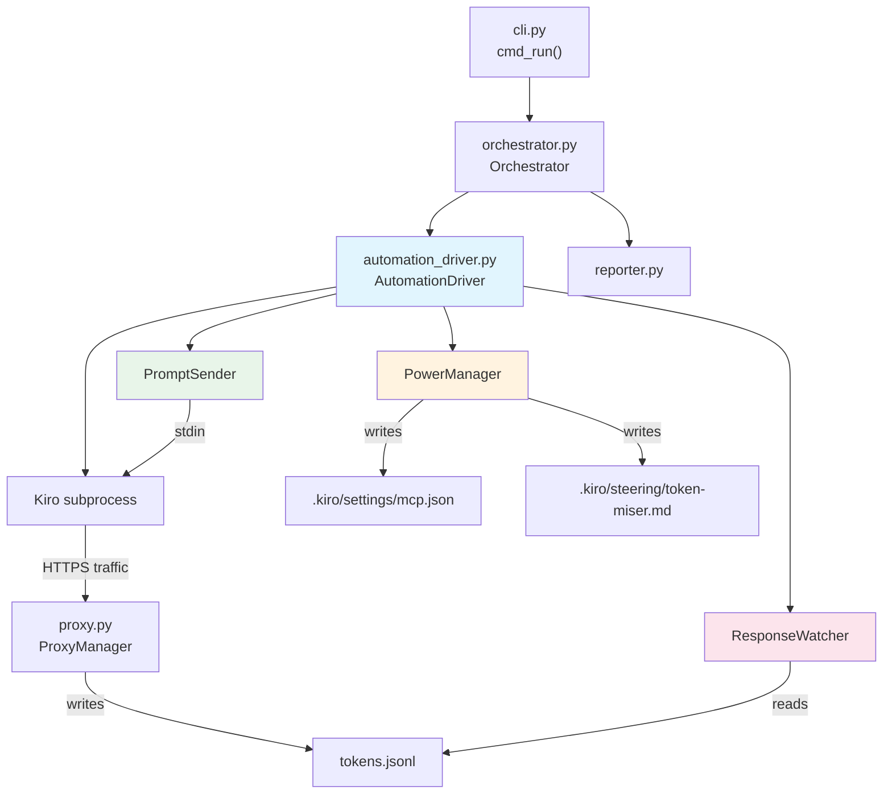
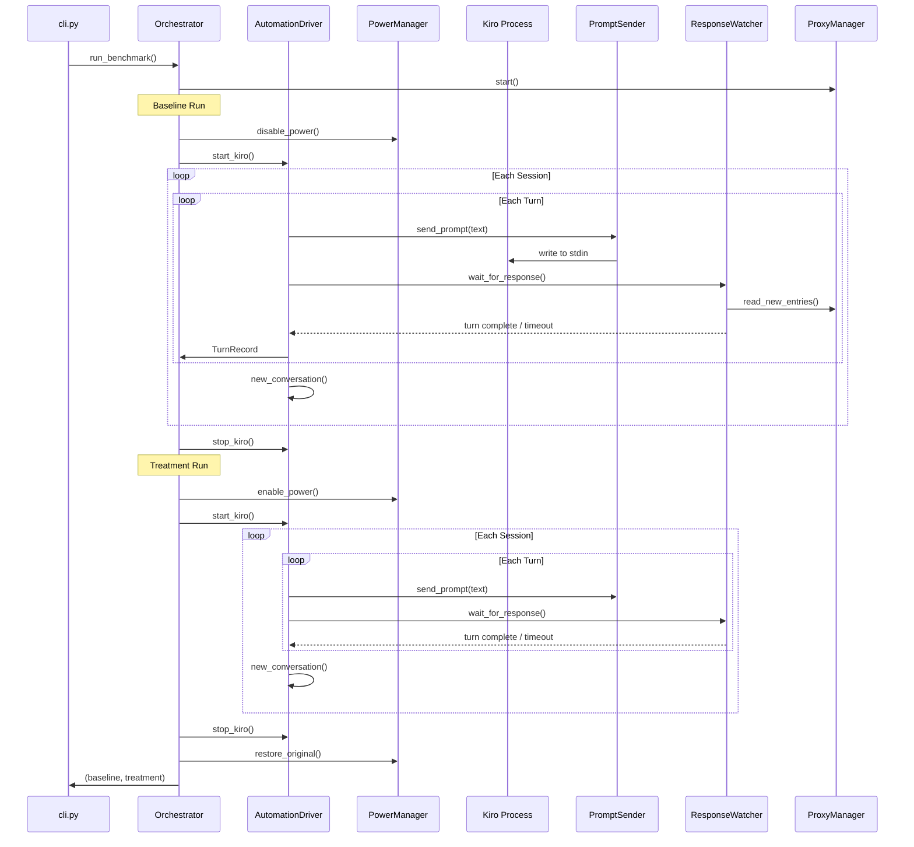

# Design Document: Automated Benchmark Testing

## Overview

This design replaces the manual `input()`-driven orchestration loop in the benchmark tool with a fully automated **Automation Driver** that launches Kiro as a subprocess, delivers prompts programmatically via Kiro's CLI stdin, detects response completion by monitoring proxy JSONL idle periods, and manages the token-miser Power state between baseline and treatment runs.

The existing modules — `proxy.py` (mitmproxy management), `session_script.py` (script generation), `reporter.py` (report generation), and `models.py` (data structures) — remain unchanged. The changes are concentrated in:

1. **New module `automation_driver.py`** — Contains `AutomationDriver`, `PromptSender`, `ResponseWatcher`, and `PowerManager` classes.
2. **Modified `orchestrator.py`** — Replaces the manual `run_single` / `run_benchmark` methods with calls to the `AutomationDriver`.
3. **Extended `models.py`** — Adds `AutomationConfig` dataclass for automation-specific settings.
4. **Extended `config.py`** — Parses the new `automation` YAML section into `AutomationConfig`.
5. **Modified `cli.py`** — Updates `cmd_run` to wire up the automation driver instead of the manual flow.

The operator runs `benchmark run --config benchmark_config.yaml` and receives the Comparison_Report at the end without further interaction.

## Architecture



### Control Flow



## Components and Interfaces

### 1. AutomationConfig (dataclass in `models.py`)

Holds automation-specific configuration parsed from the `automation` section of the YAML config.

```python
@dataclass
class AutomationConfig:
    kiro_path: str = "kiro"           # Path to Kiro executable
    idle_timeout: int = 30            # Seconds of JSONL silence → turn complete
    turn_timeout: int = 300           # Max seconds per turn
    startup_timeout: int = 60         # Max seconds to wait for Kiro to start
```

### 2. BenchmarkConfig (extended in `models.py`)

Adds an `automation` field:

```python
@dataclass
class BenchmarkConfig:
    # ... existing fields ...
    automation: AutomationConfig = field(default_factory=AutomationConfig)
```

### 3. PowerManager (in `automation_driver.py`)

Manages the token-miser Power state by modifying `.kiro/settings/mcp.json` and `.kiro/steering/token-miser.md`.

```python
class PowerManager:
    def __init__(self, repo_path: str) -> None: ...
    def backup(self) -> None: ...
    def disable_power(self) -> None: ...
    def enable_power(self) -> None: ...
    def restore(self) -> None: ...
```

**Key behaviors:**
- `backup()` — Reads and stores the original contents of both `mcp.json` and `token-miser.md` in memory. Called once before any modifications.
- `disable_power()` — Sets `"disabled": true` in `mcp.json` for the `token-miser` server entry. Renames `token-miser.md` to `token-miser.md.disabled` (removing the auto-inclusion trigger).
- `enable_power()` — Sets `"disabled": false` in `mcp.json`. Restores `token-miser.md` from the `.disabled` backup.
- `restore()` — Writes the original backed-up contents back to both files. Called in a `finally` block to guarantee cleanup.

**File paths** are resolved relative to `repo_path`:
- MCP config: `{repo_path}/.kiro/settings/mcp.json`
- Steering file: `{repo_path}/.kiro/steering/token-miser.md`

Since the benchmark tool runs from the workspace root and the `.kiro` directory is in the workspace root, `repo_path` here refers to the workspace root (the parent of `example_project`), not the target repo. The PowerManager will accept the paths directly or resolve them from the current working directory.

**Design decision:** We rename the steering file rather than modifying its content because the `inclusion: auto` frontmatter is what triggers Kiro to load it. Simply renaming it to `.disabled` is the simplest and most reliable way to prevent auto-inclusion, and it's trivially reversible.

### 4. PromptSender (in `automation_driver.py`)

Delivers prompts to Kiro's stdin.

```python
class PromptSender:
    def __init__(self, kiro_process: subprocess.Popen) -> None: ...
    def send(self, prompt: str) -> None: ...
```

**Key behaviors:**
- `send(prompt)` — Writes the prompt text followed by a newline to the Kiro process's stdin, then flushes. The prompt is delivered verbatim from the session script.
- Raises `BrokenPipeError` or `OSError` if the Kiro process has exited.

**Design decision:** Kiro's CLI accepts chat input on stdin when launched in a non-interactive/pipe mode. This is the simplest integration path — no GUI automation, no API server, just subprocess stdin. If Kiro doesn't support this mode, we'd need to fall back to a different mechanism (e.g., xdotool keyboard simulation), but the requirements assume programmatic delivery is possible.

### 5. ResponseWatcher (in `automation_driver.py`)

Monitors the proxy JSONL file to detect when Kiro has finished responding.

```python
class ResponseWatcher:
    def __init__(self, proxy: ProxyManager, idle_timeout: int, turn_timeout: int) -> None: ...
    def wait_for_response(self, start_position: int) -> WatchResult: ...
```

```python
@dataclass
class WatchResult:
    entries: List[dict]
    new_position: int
    timed_out: bool
```

**Key behaviors:**
- `wait_for_response(start_position)` — Polls `proxy.read_new_entries(start_position)` in a loop (1-second poll interval). Tracks two clocks:
  1. **Idle timer**: Resets each time new entries appear. When it exceeds `idle_timeout` after at least one entry has been received, the turn is considered complete.
  2. **Turn timer**: Starts when the method is called. If it exceeds `turn_timeout` without the idle condition being met, the turn is marked as timed out.
- Returns a `WatchResult` with all accumulated entries, the new file position, and whether the turn timed out.

**Design decision:** Polling at 1-second intervals is a good balance between responsiveness and CPU usage. The JSONL file is append-only and small, so `read_new_entries` (which seeks to a byte offset) is cheap.

### 6. AutomationDriver (in `automation_driver.py`)

Top-level coordinator that manages the Kiro subprocess lifecycle and drives the prompt/response loop.

```python
class AutomationDriver:
    def __init__(self, proxy: ProxyManager, config: BenchmarkConfig) -> None: ...
    def start_kiro(self) -> None: ...
    def stop_kiro(self) -> None: ...
    def new_conversation(self) -> None: ...
    def run_turn(self, prompt: str) -> Tuple[List[dict], bool]: ...
    def check_health(self) -> bool: ...
```

**Key behaviors:**
- `start_kiro()` — Launches `kiro {repo_path}` as a subprocess with environment variables:
  - `HTTPS_PROXY=http://localhost:{proxy_port}`
  - `HTTP_PROXY=http://localhost:{proxy_port}`
  - `NODE_TLS_REJECT_UNAUTHORIZED=0`
  - Plus the current environment (inherited).
  Waits up to `startup_timeout` seconds for the process to be alive (polls `process.poll()` to confirm it hasn't exited immediately). Raises `RuntimeError` if the process exits during startup.
- `stop_kiro()` — Sends SIGTERM, waits 5 seconds, then SIGKILL if needed. Mirrors the pattern in `ProxyManager.stop()`.
- `new_conversation()` — Stops the current Kiro process and starts a new one. This gives each session a clean conversation context.
- `run_turn(prompt)` — Sends the prompt via `PromptSender`, then calls `ResponseWatcher.wait_for_response()`. Returns the JSONL entries and a timeout flag.
- `check_health()` — Returns `True` if the Kiro process is still running (`process.poll() is None`).

**Restart logic:**
- Tracks consecutive timeout count. If 3 consecutive turns produce no JSONL entries, the driver restarts Kiro.
- Tracks total restart count per run. If restarts exceed 2, the driver raises a `BenchmarkError` to halt.

### 7. Orchestrator (modified in `orchestrator.py`)

The existing `Orchestrator` class is refactored to use `AutomationDriver` instead of `input()` loops.

```python
class Orchestrator:
    def __init__(self, script, proxy, config) -> None: ...
    def run_single(self, run_type: str) -> RunRecord: ...
    def run_benchmark(self) -> Tuple[RunRecord, RunRecord]: ...
```

**Changes to `run_single`:**
- Removes all `input()` calls and rich Panel prompts for user interaction.
- Calls `automation_driver.run_turn(turn.prompt)` for each turn.
- Calls `automation_driver.new_conversation()` between sessions.
- Prints progress lines after each turn and session (Requirement 8).
- Handles turn timeouts by recording zero credit usage and continuing.

**Changes to `run_benchmark`:**
- Creates `PowerManager` and `AutomationDriver` instances.
- Calls `power_manager.backup()` at the start.
- For baseline: calls `power_manager.disable_power()`, then `run_single("baseline")`.
- For treatment: calls `power_manager.enable_power()`, then `run_single("treatment")`.
- Wraps everything in `try/finally` to guarantee `power_manager.restore()` and `automation_driver.stop_kiro()`.
- On error, writes partial reports before exiting.

### 8. Error Handling Integration

A custom exception class for benchmark-specific errors:

```python
class BenchmarkError(Exception):
    """Raised when the benchmark must halt due to unrecoverable errors."""
    pass
```

Used by `AutomationDriver` when:
- Kiro fails to start (startup timeout or immediate exit)
- Max restarts exceeded (2 per run)
- Kiro executable not found on PATH

## Data Models

### New: AutomationConfig

```python
@dataclass
class AutomationConfig:
    kiro_path: str = "kiro"
    idle_timeout: int = 30
    turn_timeout: int = 300
    startup_timeout: int = 60

    def to_dict(self) -> dict:
        return {
            "kiro_path": self.kiro_path,
            "idle_timeout": self.idle_timeout,
            "turn_timeout": self.turn_timeout,
            "startup_timeout": self.startup_timeout,
        }

    @classmethod
    def from_dict(cls, data: dict) -> "AutomationConfig":
        return cls(
            kiro_path=data.get("kiro_path", "kiro"),
            idle_timeout=data.get("idle_timeout", 30),
            turn_timeout=data.get("turn_timeout", 300),
            startup_timeout=data.get("startup_timeout", 60),
        )
```

### New: WatchResult

```python
@dataclass
class WatchResult:
    entries: List[dict]
    new_position: int
    timed_out: bool
```

### Extended: BenchmarkConfig

```python
@dataclass
class BenchmarkConfig:
    repo_path: str
    prompt_file: str = "benchmark_output/session_script.json"
    output_dir: str = "benchmark_output"
    output_format: str = "json"
    proxy_port: int = 8080
    timeout_seconds: int = 120
    automation: AutomationConfig = field(default_factory=AutomationConfig)
```

### Extended: YAML Config Schema

```yaml
repo_path: "example_project"
prompt_file: "benchmark_output/session_script.json"
output_dir: "benchmark_output"
output_format: "json"
proxy_port: 8080
timeout_seconds: 120

automation:
  kiro_path: "kiro"
  idle_timeout: 30
  turn_timeout: 300
  startup_timeout: 60
```

### Unchanged Models

The following existing models remain unchanged:
- `Turn`, `Session`, `SessionScript` — Session script structure
- `TokenCount`, `TurnRecord`, `SessionRecord`, `RunRecord` — Run data
- `SessionComparison`, `ComparisonReport` — Comparison output


## Correctness Properties

*A property is a characteristic or behavior that should hold true across all valid executions of a system — essentially, a formal statement about what the system should do. Properties serve as the bridge between human-readable specifications and machine-verifiable correctness guarantees.*

### Property 1: PowerManager backup-restore round-trip

*For any* valid MCP config JSON content and any valid steering file content, calling `backup()` then any sequence of `disable_power()` and `enable_power()` calls, then `restore()`, SHALL produce files identical to the original content.

**Validates: Requirements 2.5, 2.6**

### Property 2: Verbatim prompt delivery

*For any* prompt string (including unicode, special characters, whitespace, empty lines, and multi-line text), the `PromptSender.send()` method SHALL write the exact string followed by a newline to the Kiro process's stdin without modification.

**Validates: Requirements 4.1, 4.4**

### Property 3: Prompt delivery ordering

*For any* valid SessionScript with multiple sessions and turns, the AutomationDriver SHALL deliver prompts in strictly ascending `session_id` order, and within each session in strictly ascending `turn_number` order.

**Validates: Requirements 4.2**

### Property 4: Sequential prompt-response discipline

*For any* sequence of turns in a session, the AutomationDriver SHALL not send the prompt for turn N+1 until `ResponseWatcher.wait_for_response()` has returned for turn N.

**Validates: Requirements 4.3**

### Property 5: Idle timeout response detection

*For any* sequence of JSONL entry arrival times and any positive `idle_timeout` value, the ResponseWatcher SHALL declare a turn complete only when: (a) at least one entry has been received, AND (b) no new entries have appeared for `idle_timeout` seconds. If no entries arrive within `turn_timeout`, the turn SHALL be marked as timed out.

**Validates: Requirements 5.2**

### Property 6: JSONL position tracking prevents double-counting

*For any* sequence of multi-turn interactions where each turn produces a variable number of JSONL entries, the ResponseWatcher SHALL return only entries that arrived after the previous turn's `wait_for_response()` completed, with zero overlap between turns.

**Validates: Requirements 5.5**

### Property 7: Session boundary new conversations

*For any* SessionScript with N sessions (N ≥ 2), the AutomationDriver SHALL call `new_conversation()` exactly N-1 times — once between each consecutive pair of sessions — and zero times within a session.

**Validates: Requirements 6.1**

### Property 8: Automation config parsing with defaults

*For any* partial automation config dictionary (where each of `kiro_path`, `idle_timeout`, `turn_timeout`, `startup_timeout` may or may not be present), parsing SHALL use the provided value when present and the documented default when absent. Serializing then parsing the result SHALL produce an equivalent `AutomationConfig`.

**Validates: Requirements 7.1, 7.2**

### Property 9: Restart after consecutive unresponsive turns

*For any* sequence of turn results during a run, the AutomationDriver SHALL restart the Kiro process if and only if 3 consecutive turns produce zero JSONL entries. A turn that produces at least one entry SHALL reset the consecutive-timeout counter to zero.

**Validates: Requirements 9.2**

### Property 10: Maximum restart limit per run

*For any* run where the Kiro process requires restarts, the AutomationDriver SHALL allow at most 2 restarts. On the 3rd restart attempt, the driver SHALL halt with a `BenchmarkError`.

**Validates: Requirements 9.4**

## Error Handling

### Kiro Process Errors

| Error Condition | Handling | Recovery |
|---|---|---|
| Kiro executable not found on PATH | `shutil.which(kiro_path)` check before proxy start | Halt with descriptive error message (Req 7.4) |
| Kiro fails to start (exits immediately) | `process.poll()` during startup wait detects non-None exit code | Log exit code + stderr, raise `BenchmarkError` (Req 3.6) |
| Kiro startup timeout | `startup_timeout` exceeded while `process.poll()` returns None but no JSONL activity | Raise `BenchmarkError` with timeout details (Req 3.6) |
| Kiro exits mid-run | `check_health()` returns False before/after prompt delivery | Log exit code + stderr, attempt restart if under limit (Req 3.5) |
| 3 consecutive unresponsive turns | Consecutive timeout counter reaches 3 | Restart Kiro, resume from current session (Req 9.2) |
| Max restarts exceeded (2 per run) | Restart counter exceeds 2 | Write partial reports, restore power state, raise `BenchmarkError` (Req 9.4) |

### Turn-Level Errors

| Error Condition | Handling | Recovery |
|---|---|---|
| Turn timeout (no entries within `turn_timeout`) | `ResponseWatcher` returns `timed_out=True` | Record zero credit usage, print warning, continue to next turn (Req 5.3, 9.1) |
| Broken pipe writing to stdin | `PromptSender.send()` catches `BrokenPipeError` | Treat as Kiro process exit, trigger restart logic (Req 3.5) |

### Power Management Errors

| Error Condition | Handling | Recovery |
|---|---|---|
| MCP config file not found | `PowerManager.backup()` raises `FileNotFoundError` | Halt before starting any run with descriptive error |
| Steering file not found | `PowerManager.backup()` logs warning | Continue — steering file may not exist in all setups |
| Restore failure (disk error) | `PowerManager.restore()` catches `OSError` | Log error with original backup content for manual recovery |

### Cleanup Guarantees

The `Orchestrator.run_benchmark()` method uses a `try/finally` block to guarantee:
1. `power_manager.restore()` is always called — even on exceptions.
2. `automation_driver.stop_kiro()` is always called — even on exceptions.
3. Partial `Token_Report` data is written to disk before exit on error (Req 9.5).

```python
def run_benchmark(self) -> Tuple[RunRecord, RunRecord]:
    power_manager = PowerManager(...)
    power_manager.backup()
    partial_baseline = None
    partial_treatment = None
    try:
        power_manager.disable_power()
        self.automation_driver.start_kiro()
        partial_baseline = self.run_single("baseline")
        self.automation_driver.stop_kiro()

        power_manager.enable_power()
        self.automation_driver.start_kiro()
        partial_treatment = self.run_single("treatment")
        self.automation_driver.stop_kiro()

        return partial_baseline, partial_treatment
    except BenchmarkError:
        # Write partial data
        if partial_baseline:
            write_token_report(partial_baseline, ...)
        raise
    finally:
        self.automation_driver.stop_kiro()
        power_manager.restore()
```

## Testing Strategy

### Property-Based Tests (Hypothesis)

The project already uses Hypothesis for property-based testing. Each correctness property maps to a single Hypothesis test with a minimum of 100 iterations.

| Property | Test Module | Strategy |
|---|---|---|
| P1: PowerManager round-trip | `tests/test_automation_driver.py` | Generate random JSON dicts and random steering file strings. Run backup → disable → enable → restore. Assert file contents match originals. |
| P2: Verbatim prompt delivery | `tests/test_automation_driver.py` | Generate random strings via `st.text()`. Mock stdin as `io.StringIO`. Call `send()`, assert written content equals input + newline. |
| P3: Prompt ordering | `tests/test_orchestrator.py` | Generate random SessionScripts with 1-5 sessions, 1-4 turns each. Mock AutomationDriver. Assert prompts delivered in session_id → turn_number order. |
| P4: Sequential prompt-response | `tests/test_orchestrator.py` | Generate random multi-turn sessions. Mock ResponseWatcher with variable delays. Assert each `send()` call happens only after previous `wait_for_response()` returns. |
| P5: Idle timeout detection | `tests/test_automation_driver.py` | Generate random entry arrival time sequences and idle_timeout values. Simulate time progression. Assert completion declared at correct moment. |
| P6: Position tracking | `tests/test_automation_driver.py` | Generate random multi-turn entry sequences with varying counts. Assert each turn's entries are disjoint from previous turns. |
| P7: Session boundary conversations | `tests/test_orchestrator.py` | Generate SessionScripts with 1-10 sessions. Mock AutomationDriver. Assert `new_conversation()` called exactly N-1 times. |
| P8: Config parsing with defaults | `tests/test_config.py` | Generate partial dicts with random subsets of automation keys. Parse, assert present values used and missing values get defaults. Round-trip serialize/parse. |
| P9: Restart after 3 consecutive timeouts | `tests/test_automation_driver.py` | Generate random boolean sequences (responsive/unresponsive turns). Assert restart triggered iff 3 consecutive unresponsive. |
| P10: Max restart limit | `tests/test_automation_driver.py` | Generate scenarios requiring 0-5 restarts. Assert halt after 2nd restart. |

**Tag format:** Each test is tagged with a comment:
```python
# Feature: automated-benchmark-testing, Property 1: PowerManager backup-restore round-trip
```

### Unit Tests (Example-Based)

| Test | What It Verifies |
|---|---|
| `test_disable_power_sets_disabled_true` | PowerManager.disable_power() sets `"disabled": true` in mcp.json (Req 2.1) |
| `test_disable_power_renames_steering_file` | PowerManager.disable_power() renames steering file to `.disabled` (Req 2.2) |
| `test_enable_power_sets_disabled_false` | PowerManager.enable_power() sets `"disabled": false` in mcp.json (Req 2.3) |
| `test_enable_power_restores_steering_file` | PowerManager.enable_power() restores steering file from `.disabled` (Req 2.4) |
| `test_start_kiro_env_vars` | AutomationDriver.start_kiro() passes correct HTTPS_PROXY, HTTP_PROXY, NODE_TLS_REJECT_UNAUTHORIZED env vars (Req 3.1) |
| `test_start_kiro_repo_path_argument` | AutomationDriver.start_kiro() passes repo_path as workspace argument (Req 3.2) |
| `test_stop_kiro_sends_sigterm` | AutomationDriver.stop_kiro() sends SIGTERM then waits (Req 3.4) |
| `test_kiro_unexpected_exit_logs_error` | AutomationDriver handles unexpected Kiro exit with logging (Req 3.5) |
| `test_kiro_startup_timeout_halts` | AutomationDriver halts with error on startup timeout (Req 3.6) |
| `test_turn_timeout_continues` | Automation continues to next turn after timeout (Req 5.4) |
| `test_turn_timeout_records_zero_usage` | Timed-out turn records zero credit usage (Req 9.1) |
| `test_kiro_not_found_halts_early` | Benchmark halts before proxy start if kiro_path not found (Req 7.4) |
| `test_config_logs_at_start` | Resolved automation config is logged at run start (Req 7.3) |
| `test_partial_report_on_error` | Partial Token_Report written to disk on benchmark halt (Req 9.5) |
| `test_power_restored_on_error` | PowerManager.restore() called even when benchmark errors (Req 9.6) |
| `test_restart_logs_session_and_turn` | Restart event log includes session ID and turn number (Req 9.3) |

### Integration Tests

| Test | What It Verifies |
|---|---|
| `test_full_benchmark_with_mock_kiro` | End-to-end run with a mock Kiro process that echoes responses. Verifies both runs complete, reports are generated, and power state is toggled correctly (Req 1.1, 1.2, 1.3). |
| `test_baseline_to_treatment_transition` | Verifies the stop → reconfigure → start sequence during run transition (Req 3.3, 6.3). |

### Test Infrastructure

- **Mock Kiro process**: A simple Python script that reads stdin lines and writes predictable responses. Used in integration tests to simulate Kiro without launching the real IDE.
- **Mock proxy entries**: Test fixtures that write JSONL entries to a temp file at controlled times, simulating the proxy's output for ResponseWatcher tests.
- **Temp directories**: All file-based tests (PowerManager, config) use `tmp_path` pytest fixtures to avoid modifying real config files.
